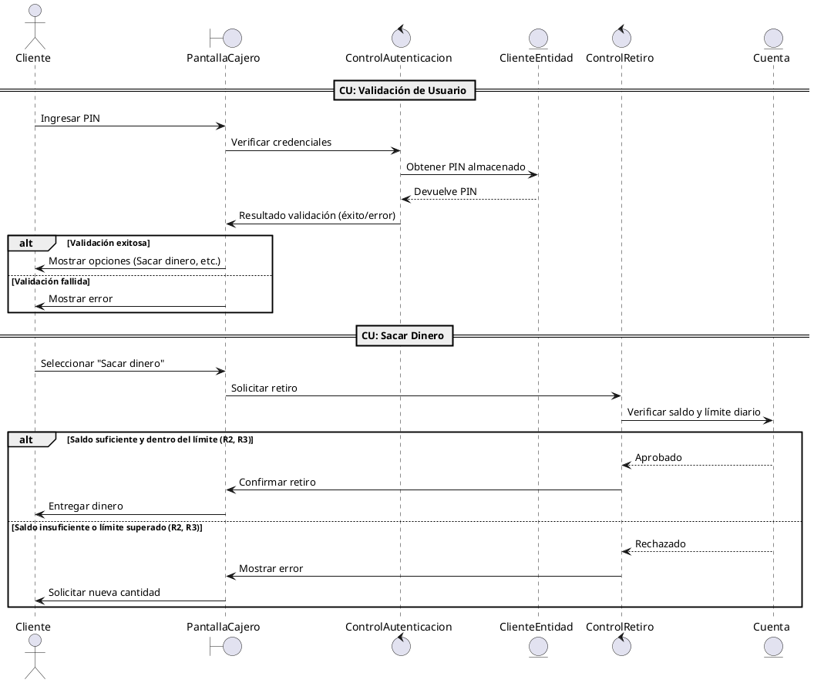
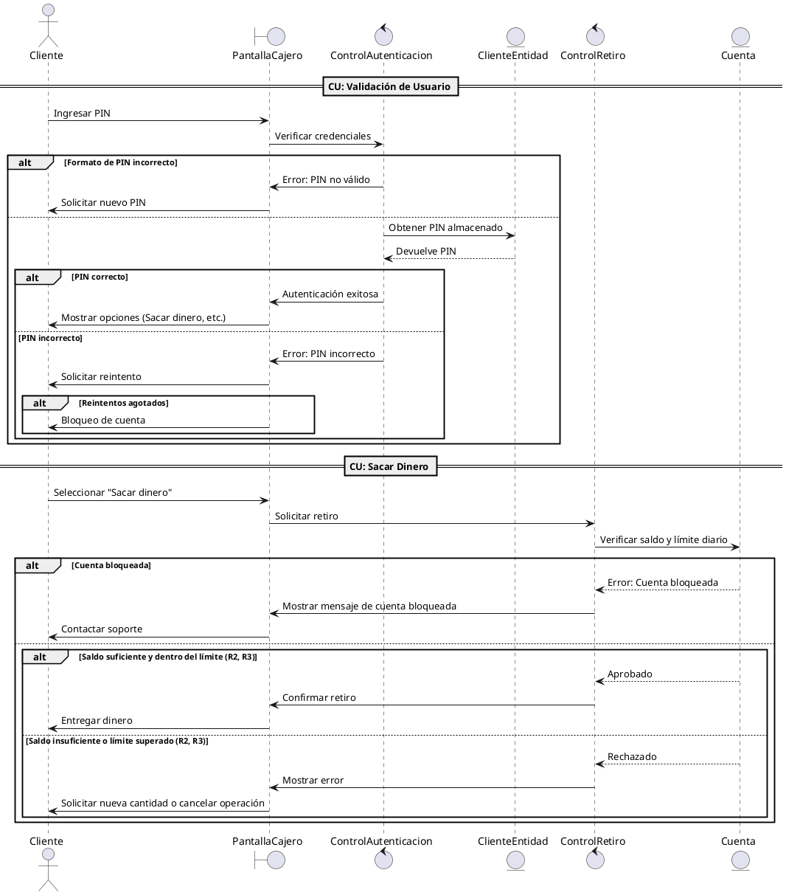

# Diagrama de Secuencias - Cajero Automático (CU: Sacar dinero y CU: Validación usuario)

## Elementos de un diagrama de secuencias

**Actor**: Representa a una entidad externa que inicia o interactúa con el sistema. En este caso, el Cliente es el actor que inicia el proceso, ingresando su PIN en el cajero automático.

**Objetos o Clases**: Son los elementos del sistema que participan en las interacciones. Estos se muestran como rectángulos con el nombre de la clase o entidad. En el ejemplo, la PantallaCajero es una interfaz que muestra los mensajes y recibe las entradas del usuario, mientras que el ControlAutenticacion es el encargado de la lógica de validación y la ClienteEntidad maneja los datos del cliente, como el PIN almacenado.

**Líneas de vida**: Representan la existencia de un objeto o actor a lo largo del tiempo en el diagrama. Se indican como una línea vertical que empieza cuando el objeto entra en el proceso y termina cuando ya no interactúa más.

**Mensajes**: Las flechas entre los elementos muestran las interacciones que ocurren en el sistema. En este diagrama, las flechas indican los pasos en el proceso de validación del cliente, como el envío del PIN desde la PantallaCajero al ControlAutenticacion y la solicitud del PIN almacenado desde el ControlAutenticacion a la ClienteEntidad.

**Condiciones (alt/else)**: Permiten representar alternativas o decisiones en el flujo de trabajo. En el caso de la validación del PIN, si la validación es exitosa, se muestran las opciones al cliente. Si la validación falla, se muestra un mensaje de error. Estas decisiones están representadas por bloques alternativos alt y else, los cuales permiten mostrar dos posibles resultados basados en una condición.

**Retornos**: Se representan con una flecha de regreso y generalmente indican la respuesta de un objeto a otro. En este caso, la ClienteEntidad devuelve el PIN almacenado al ControlAutenticacion para su comparación.

## a) Crear Diagramas de Secuencias

### 1. Clases Estereotipadas (Interfaces, Control, Entidad)

#### Caso de Uso: Validación de Usuario

- **Interfaces:**
  - **PantallaCajero:** Interfaz responsable de mostrar los mensajes al cliente y recibir la entrada de datos (como el PIN).
  
- **Control:**
  - **ControlAutenticacion:** Control que gestiona la validación de las credenciales del usuario, interactuando con la interfaz y la entidad.
  
- **Entidad:**
  - **ClienteEntidad:** Entidad que maneja la información del cliente, como el PIN almacenado.

#### Caso de Uso: Sacar Dinero

- **Interfaces:**
  - **PantallaCajero:** Interfaz que muestra las opciones al cliente y permite la interacción con el proceso de retiro.
  
- **Control:**
  - **ControlRetiro:** Control encargado de gestionar el proceso de retiro de dinero, verificando el saldo y los límites.
  
- **Entidad:**
  - **Cuenta:** Entidad que maneja la información de la cuenta del cliente, como el saldo disponible y el límite diario.

### 2. Diagrama de Secuencias Básico (Estereotipado)

Este diagrama muestra cómo interactúan los actores y los componentes del sistema (clases estereotipadas) durante el proceso de validación de usuario y retiro de dinero.

## 3. Diagrama de Secuencia Final (Diseño)

Después de analizar las clases de diseño basadas en las estereotipadas, podemos agregar detalles adicionales sobre la interacción de clases y objetos. Esto incluye el manejo de excepciones, la validación de entradas y la interacción con el sistema.

### Diferencias frente al diagrama básico

**Manejo de errores en la validación de usuario:**  
Se verifica si el formato del PIN es correcto antes de enviarlo para su validación. Además, si el PIN es incorrecto, se permite un número limitado de intentos antes de bloquear la cuenta.

**Bloqueo de cuenta tras varios intentos fallidos:**  
Cuando el usuario ingresa un PIN incorrecto repetidamente, la cuenta se bloquea.

**Verificación de cuenta bloqueada antes de un retiro:**  
Si la cuenta está bloqueada, se notifica al usuario para que contacte con el soporte antes de continuar.

**Mejor manejo de errores en la transacción de retiro:**  
En caso de saldo insuficiente o si se supera el límite diario, se ofrece la opción de ingresar una nueva cantidad o cancelar la operación.

## b) Interpretación del Diagrama Final de CU: Validación de Usuario

### Descripción:

Este diagrama describe el proceso en el que un cliente intenta validarse en el cajero automático mediante el uso de su PIN.

1. **Cliente** inicia el proceso ingresando su PIN en la **PantallaCajero**.
2. La **PantallaCajero** envía el PIN ingresado al **ControlAutenticacion**, que es el encargado de verificar si las credenciales son correctas.
3. El **ControlAutenticacion** solicita el PIN almacenado al **ClienteEntidad**, que se encarga de manejar los datos del cliente. Este devuelve el PIN almacenado.
4. El **ControlAutenticacion** compara el PIN ingresado con el almacenado, y dependiendo del resultado:
   - Si la validación es exitosa, la **PantallaCajero** mostrará las opciones al **Cliente**.
   - Si la validación falla, se le mostrará un mensaje de error al **Cliente**.

Este proceso permite validar que el cliente tiene acceso a las funcionalidades del cajero, como la posibilidad de realizar un retiro de dinero.

---

## c) ¿De qué manera te ayuda un diagrama de secuencias durante el proceso de desarrollo del software?

Un diagrama de secuencias es una herramienta clave para visualizar cómo los diferentes objetos y componentes del sistema interactúan en un orden temporal, proporcionando un enfoque claro sobre las interacciones necesarias y facilitando la comprensión de los procesos. Durante el desarrollo, es útil porque permite clarificar cómo los objetos interactúan entre sí, lo que facilita su implementación, y ayuda a detectar posibles errores en el diseño o incoherencias en el flujo de mensajes entre los objetos. Además, mejora la comunicación dentro del equipo de desarrollo al ofrecer una representación visual fácil de entender por todos, lo que favorece la colaboración, y optimiza el flujo de trabajo al identificar pasos redundantes o ineficientes que pueden ser mejorados para lograr un diseño más eficiente.
